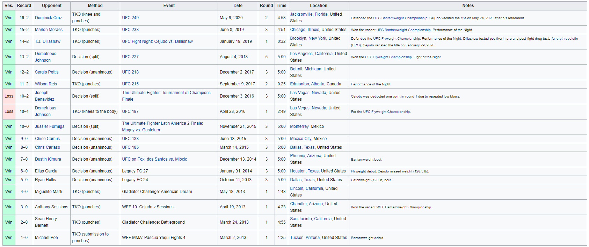

# Passion Projects
During my limited free time, I enjoy creating new datasets and highlighting new insights about topics. 

### MMA Fights
During the pandemic, I started to watch a lot of UFC events. I realized that there wasn't really any time series data. Most statistics would be about individual fighters, telling us about their personal records. I decided I wanted to change that. I wrote a script to scrape Wikipedia tables related to UFC fights. Specifically, I saw that all the Wikipedia pages for fighters had the same table recording information about fights during their careers. For example, on [Henry Cejudo's Wiki](https://en.wikipedia.org/wiki/Henry_Cejudo){:target="_blank"}, the table looks like

I wrote the script to extract all the data on the table for one fighter, then store the Wikipedia links for each fighter he had fought, then go to the pages for those fighters and extract the same information, and repeat. As you can see in the table, some fighters do not have a link. While I can create a list of their observed fights by using other fighters' tables, I will not see fights that are not recorded. The same applies even for linked fighters, for example if their first professional fight was not recorded to Wikipedia. In other words, the data set suffers from survivorship bias. For fighters that eventually fight in more established organizations or begin their careers in later years, this is less of an issue. 

  

The next step will be to take the scoring cards, which contain the judge names and judging decisions, and merge the data so that I observe round-by-round judging decisions within the data. 

---
